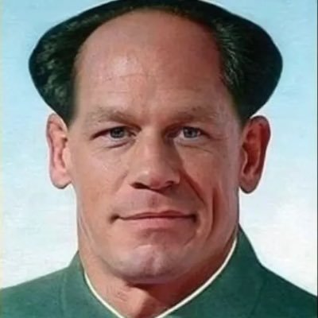
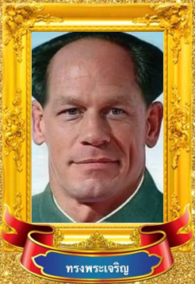

# Golden Frame

กรอบทอง Generator

_work in progress, making a Python Package is so complex just like npm_

## Example

 **+**
 **=**


PS. The original picture of golden frame is K-Pop Star (Search: กรอบทอง ทรงพระเจริญ in Google, there are many variant)

### Command for Above Example

```bash
src/cli.py build golden_frame.png example/zhongxina_before.jpg --output=example/zhongxina_after.png
```

## Adding Images

file_name.json Schema

```json
{
  "name": "Golden Frame ทพจร",
  "pos": "40,40,205,278"
}
```

pos => x1,y1,x2,y2 ; Position to put pictures on, you can get these info using Paint

## TODO

- Upload to PyPi (This is so mucking hard, muck Python)
